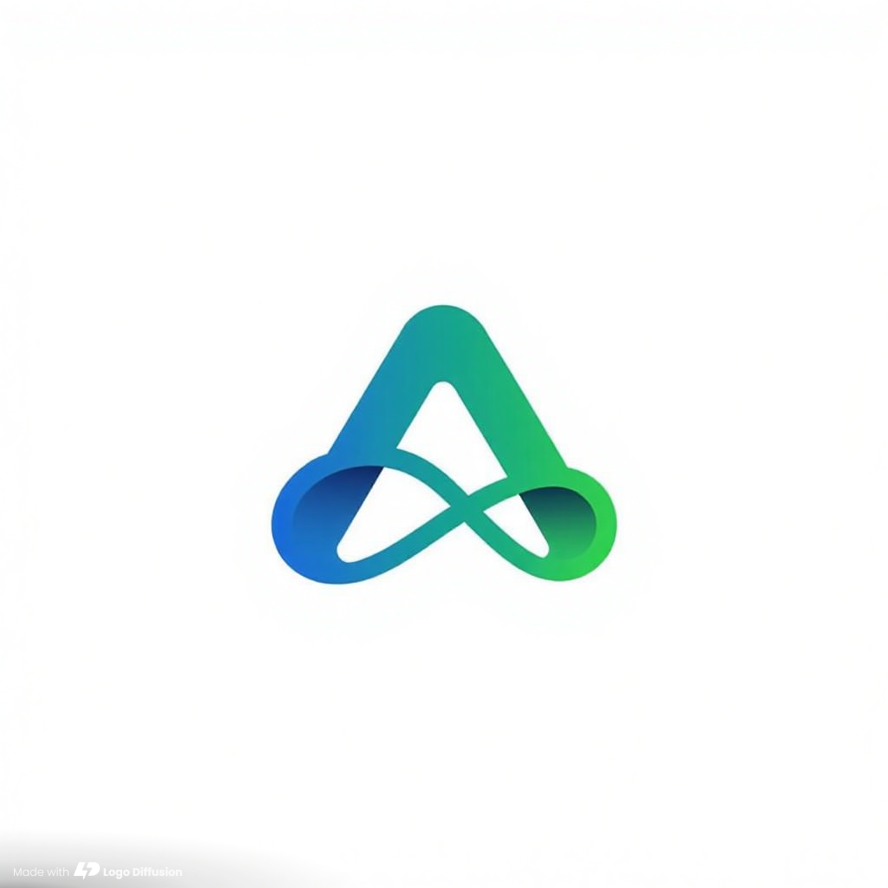
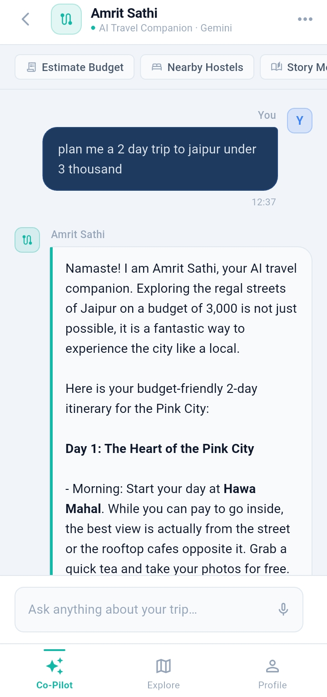
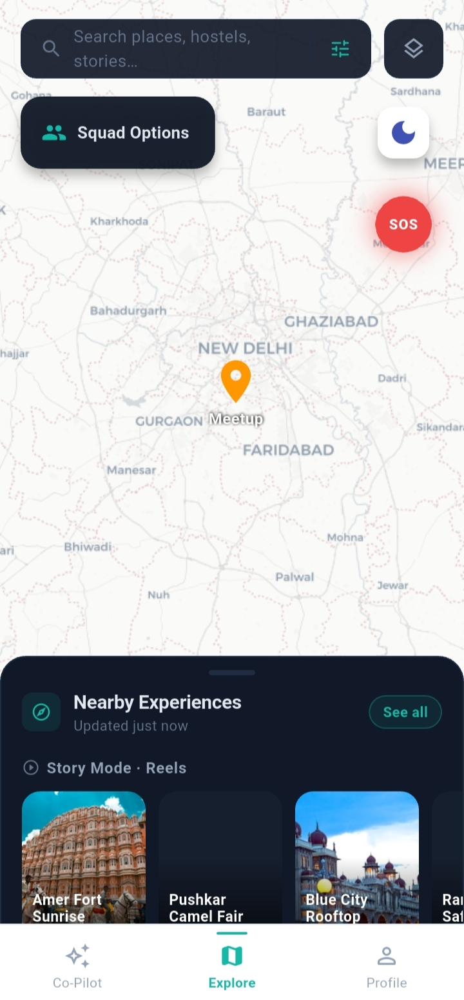
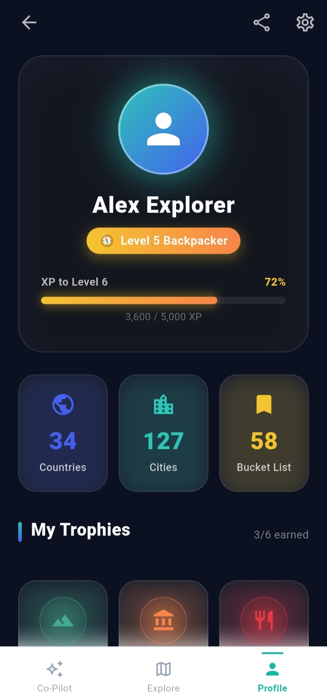

<div align="center">

  

  # 🇮🇳 Amrit Sathi 

  **An AI-powered, offline-first group travel companion designed to redefine how you explore.**

  [](https://flutter.dev/)
  [](https://dart.dev/)
  [](https://deepmind.google/technologies/gemini/)
  [](http://makeapullrequest.com)
  [](#-contributing)

</div>

---

## 📖 About the Project

Amrit Sathi isn't just another generic travel booking app. It is a contextual, persistent travel brain that helps you plan, navigate, and stay connected with your squad—even when you lose signal in the mountains. 

Built natively with **Flutter** and powered dynamically by **Google Gemini**, Amrit Sathi features a premium dark-mode aesthetic and intelligent local caching to ensure your travel data is always at your fingertips. 

---

## ✨ Key Features

* **🤖 AI Travel Copilot:** Powered by Google Gemini. Ask for hyper-contextual itineraries, hidden gems, or cultural insights, and the AI builds your trip on the fly.
* **🗺️ Offline Squad Map:** Lose network in the Himalayas? The local persistent memory simulates offline tracking so you never lose your group.
* **📸 Story & Reels UI:** A modern, dynamic social feed to capture and share your travel moments seamlessly.
* **🌙 Premium Native UI:** Built from the ground up with a custom sleek `#0B1120` dark theme, complete with a native splash screen and optimized asset bundles.
* **🔒 Secure Environment:** API keys and sensitive configurations are managed via a strict `.env` vault, keeping your credentials safe.

---

## 📱 Screenshots

| AI Travel Copilot | Offline Squad Map | Premium Dark UI |
| :---: | :---: | :---: |
|  |  |  |
| *Dynamic, context-aware itineraries built by Gemini.* | *Keep track of your squad, even offline.* | *Sleek `#0B1120` dark theme aesthetic.* |

---
## 🛠️ Tech Stack & System Architecture

### **Frontend (Mobile)**
* **Framework:** Flutter / Dart (Cross-platform)
* **State Management:** Riverpod (For robust, scalable application state)
* **Local Database:** Hive (Lightweight, NoSQL persistent storage for offline-first data)
* **Maps:** Google Maps Flutter SDK (with custom Dark Mode styling)

### **Proposed Backend & DevOps**
* **AI Orchestration:** FastAPI (Python) + LangChain - For secure, high-performance AI agent routing and tool integration.
* **Database & Auth:** Supabase (PostgreSQL) - Managing user profiles, squad synchronization, and shared itineraries.
* **Spatial Data:** PostGIS - For advanced location-based queries (e.g., finding nearby squad members or hidden gems).
* **Infrastructure:** Google Cloud Run / Docker (Scalable, serverless hosting).
* **CI/CD:** GitHub Actions (Automated testing and PR formatting checks).

---

## 🚀 Getting Started

Want to run Amrit Sathi locally? Follow these steps:

### 1. Clone the repository
```bash
git clone [https://github.com/divyant06/Amrit-Sathi.git](https://github.com/divyant06/Amrit-Sathi.git)
cd Amrit-Sathi
```
### 2. Install dependencies
```bash
flutter pub get
```
3. Setup the AI Vault (.env)
Because security is a priority, API keys are not committed to this repository. You must create your own local environment file.
Create a file named .env in the root directory and add your Gemini API key:
```bash
GEMINI_API_KEY=your_api_key_here
```
4. Run the app
```bash
flutter run
```
(To build a production-ready physical APK for your Android device, run: flutter build apk --release --no-tree-shake-icons)

🤝 Contributing (GSSoC Welcome!)
We are thrilled to be an Admin Project for GirlScript Summer of Code (GSSoC)! Whether you are a beginner looking for your first PR or an experienced developer, we have a place for you.

How to Contribute:
Find an Issue: Look for issues labeled good first issue, gssoc, or help wanted in the Issues tab.

Fork & Clone: Fork this repository to your GitHub account and clone it to your local machine.

Create a Branch: Create a new branch for your feature or bug fix (git checkout -b feature/your-feature-name).

Make Changes: Write your code, ensure it aligns with our styling, and test it locally.

Commit & Push: Commit your changes (git commit -m "Add cool new feature") and push to your fork (git push origin feature/your-feature-name).

Open a PR: Open a Pull Request from your fork to our main branch. Provide a clear description of what you changed!
---
🗺️ Project Roadmap
[x] Phase 1: Core UI layout and Premium Dark Mode (#0B1120).

[x] Phase 2: Gemini AI integration (google_generative_ai) for contextual trip planning.

[x] Phase 3: Local persistent memory for offline functionality.

[ ] Phase 4: Transition from local .env vaults to a scalable cloud based robust backend (Supabase + FastAPI).

[ ] Phase 5: Advanced Squad mapping and real-time sync via WebSockets.Upgrade from simulated offline tracking to live GPS tracking.
Utilize WebSockets for instant location updates between squad members.
Implement "Geofencing" alerts for group safety.

[ ] Phase 6: Official launch on the Google Play Store.
---
📬 Connect & Feedback
Currently in active development. If you want the beta .apk to test it on your physical phone, or if you have brutal feedback, reach out!

Created with ❤️ by Divyant Linkedin:[https://www.linkedin.com/in/divyant-poddar/](https://www.linkedin.com/in/divyant-poddar/)
